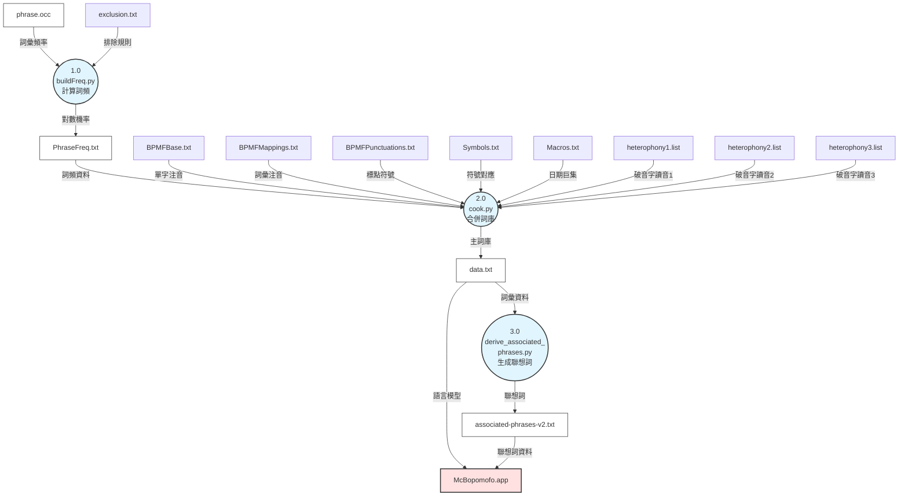

# 小麥注音輸入法演算法說明

本文件詳細說明小麥注音輸入法的核心演算法，包括注音符號到中文字詞的預測轉換機制、語言模型架構、以及字典資料的生成與使用方式。

## 建置與測試

詳細的建置與測試說明請參閱根目錄的 `AGENTS.md` 文件。
- **開發環境需求：** macOS 14.7+, Xcode 15.3+, Python 3.9+
- **執行環境需求：** macOS 10.15 (Catalina) 或以上版本

---

## 目錄

- [小麥注音輸入法演算法說明](#小麥注音輸入法演算法說明)
  - [建置與測試](#建置與測試)
  - [目錄](#目錄)
  - [整體架構](#整體架構)
    - [基本運作流程](#基本運作流程)
  - [注音轉換演算法：Gramambular](#注音轉換演算法gramambular)
    - [基本概念](#基本概念)
    - [資料結構](#資料結構)
      - [1. Unigram (語元)](#1-unigram-語元)
      - [2. Node (節點)](#2-node-節點)
      - [3. Span (跨度)](#3-span-跨度)
      - [4. ReadingGrid (讀音網格)](#4-readinggrid-讀音網格)
    - [演算法流程](#演算法流程)
      - [插入注音時的處理](#插入注音時的處理)
      - [節點更新機制](#節點更新機制)
      - [最佳路徑演算法：DAG 最短路徑](#最佳路徑演算法dag-最短路徑)
    - [實際範例](#實際範例)
  - [語言模型架構](#語言模型架構)
    - [McBopomofoLM：統一介面](#mcbopomofolm統一介面)
    - [Unigram 處理流水線](#unigram-處理流水線)
      - [階段 1：收集原始 Unigrams](#階段-1收集原始-unigrams)
      - [階段 2：過濾與轉換](#階段-2過濾與轉換)
      - [階段 3：使用者詞彙分數調整](#階段-3使用者詞彙分數調整)
    - [ParselessLM 與二元搜尋](#parselesslm-與二元搜尋)
      - [ParselessPhraseDB 資料格式](#parselessphrasedb-資料格式)
      - [二元搜尋實作](#二元搜尋實作)
  - [字典資料的生成與使用](#字典資料的生成與使用)
    - [資料檔案結構](#資料檔案結構)
      - [輸入檔案（手動維護）](#輸入檔案手動維護)
      - [輸出檔案（自動生成）](#輸出檔案自動生成)
    - [編譯流程](#編譯流程)
    - [頻率計算](#頻率計算)
      - [步驟 1：載入資料](#步驟-1載入資料)
      - [步驟 2：排除計數調整](#步驟-2排除計數調整)
      - [步驟 3：正規化與對數轉換](#步驟-3正規化與對數轉換)
    - [破音字處理](#破音字處理)
    - [資料排序的重要性](#資料排序的重要性)
  - [關鍵程式碼位置](#關鍵程式碼位置)
    - [演算法核心](#演算法核心)
    - [語言模型](#語言模型)
    - [字典資料處理](#字典資料處理)
    - [Swift \& Objective-C++ 層](#swift--objective-c-層)
    - [測試](#測試)
  - [延伸閱讀](#延伸閱讀)

---

## 整體架構

小麥注音輸入法採用三層式架構設計：

1. **Swift 層**（UI & State Management）
   - IMK 整合與使用者介面元件
   - 狀態機實作
   - 偏好設定管理

2. **Objective-C++ 橋接層**
   - 連接 Swift 事件與 C++ 引擎
   - 封裝 C++ 語言模型供 Swift 使用

3. **C++ 引擎層**
   - 核心語言處理與資料結構
   - Bopomofo 音節處理
   - 文字分段演算法

### 基本運作流程

1. **鍵盤事件處理**：使用者按下按鍵 → `InputMethodController` 接收事件
2. **注音驗證**：透過 `Mandarin` 模組驗證是否為合法注音符號
3. **語言模型查詢**：向 `McBopomofoLM` 查詢符合注音的字詞
4. **建立候選網格**：將字詞插入 `ReadingGrid`
5. **路徑計算**：`ReadingGrid` 執行 walk 演算法找出最佳組合
6. **結果輸出**：將結果回傳至使用者正在輸入的應用程式

---

## 注音轉換演算法：Gramambular

Gramambular 是小麥注音的核心選字引擎，負責從多組注音符號對應的候選字詞中，找出機率最高的組合結果。

### 基本概念

小麥注音目前僅使用 **Unigram 語言模型**，這意味著：
- 每個字詞都有獨立的出現機率（不考慮上下文）
- 透過最大似然估計（Maximum Likelihood Estimation）找出最佳路徑
- 使用 **對數機率**（log probability）避免數值下溢問題

### 資料結構

Gramambular 使用三種核心資料結構，定義於 `Source/Engine/gramambular2/reading_grid.h`：

#### 1. Unigram (語元)

```cpp
class LanguageModel::Unigram {
    std::string value_;      // 字詞本身，如「在」
    std::string rawValue_;   // 原始值（用於轉換前追蹤）
    double score_;           // 對數機率分數，如 -2.23651546
};
```

#### 2. Node (節點)

```cpp
class Node {
    std::string reading_;                        // 讀音，如「ㄗㄞˋ」
    size_t spanningLength_;                      // 跨越長度（佔幾個注音）
    std::vector<LanguageModel::Unigram> unigrams_; // 候選字詞列表
    OverrideType overrideType_;                  // 使用者選字覆寫狀態
};
```

一個 Node 代表：
- 特定讀音下的所有候選字詞
- 該字詞在網格中佔據的長度
- 使用者是否手動選字（override）

#### 3. Span (跨度)

```cpp
class Span {
    std::array<NodePtr, kMaximumSpanLength> nodes_;  // 最多 8 個不同長度的節點
    size_t maxLength_;                               // 當前最大長度
};
```

一個 Span 是相同起點位置的節點集合，依長度分類（1字詞、2字詞...最多8字詞）。

#### 4. ReadingGrid (讀音網格)

```cpp
class ReadingGrid {
    std::vector<std::string> readings_;    // 使用者輸入的注音序列
    std::vector<Span> spans_;              // 每個位置的 Span
    size_t cursor_;                        // 游標位置
    ScoreRankedLanguageModel lm_;          // 語言模型介面
};
```

ReadingGrid 是所有 Span 的集合，大小等於輸入的注音數量。

### 演算法流程

#### 插入注音時的處理

當使用者輸入一個新的注音符號時（`Source/Engine/gramambular2/reading_grid.cpp:51`）：

```cpp
bool ReadingGrid::insertReading(const std::string& reading) {
    // 1. 驗證注音是否有對應字詞
    if (!lm_.hasUnigrams(reading)) {
        return false;
    }

    // 2. 插入讀音到序列中
    readings_.insert(readings_.begin() + cursor_, reading);

    // 3. 擴展網格（新增一個 Span 位置）
    expandGridAt(cursor_);

    // 4. 更新受影響範圍的節點
    update();

    // 5. 移動游標
    ++cursor_;
    return true;
}
```

#### 節點更新機制

`update()` 方法會在游標附近的範圍內（前後 8 個位置），嘗試建立所有可能的多字詞節點：

```cpp
void ReadingGrid::update() {
    size_t begin = (cursor_ <= kMaximumSpanLength) ? 0 : cursor_ - kMaximumSpanLength;
    size_t end = cursor_ + kMaximumSpanLength;

    for (size_t pos = begin; pos < end; pos++) {
        for (size_t len = 1; len <= kMaximumSpanLength && pos + len <= end; len++) {
            // 組合連續的注音（用 "-" 分隔）
            std::string combinedReading = combineReading(
                readings_.begin() + pos,
                readings_.begin() + pos + len
            );

            // 向語言模型查詢是否有對應字詞
            auto unigrams = lm_.getUnigrams(combinedReading);
            if (!unigrams.empty()) {
                // 建立新節點並插入對應的 Span
                insert(pos, std::make_shared<Node>(combinedReading, len, unigrams));
            }
        }
    }
}
```

#### 最佳路徑演算法：DAG 最短路徑

`walk()` 方法使用 **有向無環圖（DAG）最短路徑演算法** 找出分數最高的路徑（`reading_grid.cpp:216`）：

**步驟 1：建立 DAG**

```cpp
ReadingGrid::WalkResult ReadingGrid::walk() {
    // 1. 將所有 Node 轉換為圖的 Vertex（頂點）
    std::vector<VertexSpan> vspans(spans_.size());
    for (size_t i = 0; i < spans_.size(); i++) {
        const Span& span = spans_[i];
        for (size_t j = 1; j <= span.maxLength(); j++) {
            NodePtr node = span.nodeOf(j);
            if (node != nullptr) {
                vspans[i].emplace_back(Vertex(node));
            }
        }
    }

    // 2. 建立邊（Edge）：連接相鄰節點
    for (size_t i = 0; i < vspans.size(); i++) {
        for (Vertex& v : vspans[i]) {
            size_t nextPos = i + v.node->spanningLength();
            // 連接到下一個位置的所有節點
            for (Vertex& nv : vspans[nextPos]) {
                v.edges.push_back(&nv);
            }
        }
    }
```

**步驟 2：拓撲排序**

使用非遞迴的深度優先搜尋（DFS）進行拓撲排序（`reading_grid.cpp:166`）：

```cpp
std::vector<Vertex*> TopologicalSort(Vertex* root) {
    std::vector<Vertex*> result;
    std::stack<State> stack;
    stack.emplace(root);

    while (!stack.empty()) {
        State& state = stack.top();
        Vertex* v = state.v;

        if (state.edgeIter != v->edges.end()) {
            Vertex* nv = *state.edgeIter;
            ++state.edgeIter;
            if (!nv->topologicallySorted) {
                stack.emplace(nv);
                continue;
            }
        }

        v->topologicallySorted = true;
        result.push_back(v);
        stack.pop();
    }
    return result;
}
```

**步驟 3：鬆弛演算法（Relaxation）**

對拓撲排序後的頂點依序執行鬆弛操作，找出最大權重路徑（`reading_grid.cpp:134`）：

```cpp
void Relax(Vertex* u, Vertex* v) {
    double w = v->node->score();  // 獲取節點的對數機率

    // 因為我們要找最大權重，所以用 > 而非 <
    if (v->distance < u->distance + w) {
        v->distance = u->distance + w;
        v->prev = u;  // 記錄前驅節點
    }
}

// 主流程
std::vector<Vertex*> ordered = TopologicalSort(&root);
for (auto it = ordered.rbegin(); it != ordered.rend(); ++it) {
    Vertex* u = *it;
    for (Vertex* v : u->edges) {
        Relax(u, v);
    }
}
```

**步驟 4：回溯路徑**

從終點回溯找出完整路徑：

```cpp
std::vector<NodePtr> walked;
Vertex* it = &terminal;
while (it->prev != nullptr) {
    walked.push_back(it->prev->node);
    it = it->prev;
}
// 反轉得到正確順序
result.nodes = std::vector<NodePtr>(walked.rbegin() + 1, walked.rend());
```

### 實際範例

假設使用者輸入「ㄗㄞˋ ㄨㄛˇ ㄆㄧㄥˊ ㄈㄢˊ」（在我平凡），網格結構如下：

| 位置 | 0 | 1 | 2 | 3 |
|------|---|---|---|---|
| **注音** | ㄗㄞˋ | ㄨㄛˇ | ㄆㄧㄥˊ | ㄈㄢˊ |
| **4字Span** | | | | |
| **3字Span** | | | | |
| **2字Span** | | | 平凡(-5.14) | |
| **1字Span** | 在(-2.24) | 我(-2.27) | 平(-3.27) | 繁(-4.14) |
| | 再(-4.12) | | 萍(-6.89) | 凡(-5.33) |

可能的路徑與分數：

1. **在 → 我 → 平凡**：-2.24 + -2.27 + -5.14 = **-9.65** (最高分)
2. **在 → 我 → 平 → 繁**：-2.24 + -2.27 + -3.27 + -4.14 = -11.92
3. **再 → 我 → 平凡**：-4.12 + -2.27 + -5.14 = -11.53

演算法選擇分數最高的路徑「在我平凡」作為輸出結果。

---

## 語言模型架構

### McBopomofoLM：統一介面

`McBopomofoLM` (`Source/Engine/McBopomofoLM.h`) 是語言模型的 Facade 類別，整合多個資料來源：

```cpp
class McBopomofoLM : public Formosa::Gramambular2::LanguageModel {
protected:
    ParselessLM languageModel_;           // 主要詞庫
    UserPhrasesLM userPhrases_;           // 使用者自訂詞彙
    UserPhrasesLM excludedPhrases_;       // 使用者排除詞彙
    PhraseReplacementMap phraseReplacement_;  // 詞彙替換表
    AssociatedPhrasesV2 associatedPhrasesV2_; // 聯想詞

    bool phraseReplacementEnabled_;       // 是否啟用詞彙替換
    bool externalConverterEnabled_;       // 是否啟用外部轉換（如簡繁轉換）
    std::function<std::string(const std::string&)> externalConverter_;
    std::function<std::string(const std::string&)> macroConverter_;
};
```

### Unigram 處理流水線

當 `ReadingGrid` 向 `McBopomofoLM` 查詢某個讀音的 unigrams 時，會經過以下處理流程（`McBopomofoLM.cpp:81`）：

#### 階段 1：收集原始 Unigrams

```cpp
std::vector<Unigram> McBopomofoLM::getUnigrams(const std::string& key) {
    std::vector<Unigram> allUnigrams;
    std::vector<Unigram> userUnigrams;
    std::unordered_set<std::string> excludedValues;
    std::unordered_set<std::string> insertedValues;

    // 1. 載入排除清單
    if (excludedPhrases_.hasUnigrams(key)) {
        std::vector<Unigram> excludedUnigrams = excludedPhrases_.getUnigrams(key);
        for (const auto& u : excludedUnigrams) {
            excludedValues.insert(u.value());
        }
    }

    // 2. 處理使用者自訂詞彙
    if (userPhrases_.hasUnigrams(key)) {
        std::vector<Unigram> rawUserUnigrams = userPhrases_.getUnigrams(key);
        userUnigrams = filterAndTransformUnigrams(rawUserUnigrams,
                                                  excludedValues,
                                                  insertedValues);
    }

    // 3. 處理主詞庫
    if (languageModel_.hasUnigrams(key)) {
        std::vector<Unigram> rawGlobalUnigrams = languageModel_.getUnigrams(key);
        allUnigrams = filterAndTransformUnigrams(rawGlobalUnigrams,
                                                 excludedValues,
                                                 insertedValues);
    }
```

#### 階段 2：過濾與轉換

`filterAndTransformUnigrams` 執行以下步驟（`McBopomofoLM.cpp:234`）：

```cpp
std::vector<Unigram> McBopomofoLM::filterAndTransformUnigrams(
    const std::vector<Unigram> unigrams,
    const std::unordered_set<std::string>& excludedValues,
    std::unordered_set<std::string>& insertedValues) {

    std::vector<Unigram> results;

    for (auto&& unigram : unigrams) {
        const std::string& rawValue = unigram.value();

        // 步驟 1：過濾排除詞彙
        if (excludedValues.find(rawValue) != excludedValues.end()) {
            continue;
        }

        std::string value = rawValue;

        // 步驟 2：詞彙替換（如果啟用）
        if (phraseReplacementEnabled_) {
            std::string replacement = phraseReplacement_.valueForKey(value);
            if (!replacement.empty()) {
                value = replacement;
            }
        }

        // 步驟 3：巨集轉換（如日期巨集）
        if (macroConverter_ != nullptr) {
            std::string replacement = macroConverter_(value);
            if (value != replacement) {
                value = replacement;
            }
        }

        // 步驟 4：外部轉換（如簡繁轉換）
        if (externalConverterEnabled_ && externalConverter_ != nullptr) {
            std::string replacement = externalConverter_(value);
            if (value != replacement) {
                value = replacement;
            }
        }

        // 步驟 5：去重
        if (insertedValues.find(value) == insertedValues.end()) {
            results.emplace_back(value, unigram.score(), rawValue);
            insertedValues.insert(value);
        }
    }
    return results;
}
```

完整流水線：

```
原始 Unigrams
    ↓
步驟 1: 排除過濾
    ↓
步驟 2: 詞彙替換
    ↓
步驟 3: 巨集轉換
    ↓
步驟 4: 外部轉換
    ↓
步驟 5: 去重處理
    ↓
最終 Unigrams
```

#### 階段 3：使用者詞彙分數調整

對於單音節使用者詞彙，需要特別處理以避免過度優先（`McBopomofoLM.cpp:120`）：

```cpp
bool isKeyMultiSyllable =
    key.find(Formosa::Gramambular2::ReadingGrid::kDefaultSeparator) != std::string::npos;

if (isKeyMultiSyllable || allUnigrams.empty()) {
    // 多音節或無詞庫詞彙：直接使用使用者詞彙（分數為 0）
    allUnigrams.insert(allUnigrams.begin(), userUnigrams.begin(), userUnigrams.end());
} else if (!userUnigrams.empty()) {
    // 單音節：調整分數為最高分 + epsilon
    double topScore = std::numeric_limits<double>::lowest();
    for (const auto& unigram : allUnigrams) {
        if (unigram.score() > topScore) {
            topScore = unigram.score();
        }
    }

    constexpr double epsilon = 0.000000001;
    double boostedScore = topScore + epsilon;

    std::vector<Unigram> rewrittenUserUnigrams;
    for (const auto& unigram : userUnigrams) {
        rewrittenUserUnigrams.emplace_back(
            Unigram(unigram.value(), boostedScore)
        );
    }
    allUnigrams.insert(allUnigrams.begin(),
                      rewrittenUserUnigrams.begin(),
                      rewrittenUserUnigrams.end());
}
```

**原理**：
- 使用者詞彙預設分數為 0（最高）
- 對於單音節詞（如「丼」對應「ㄉㄨㄥˋ」），如果分數為 0，會導致多音節詞（如「動作」= 「ㄉㄨㄥˋ-ㄗㄨㄛˋ」）永遠無法勝出
- 解決方法：將單音節使用者詞彙分數設為「主詞庫最高分 + epsilon」，既保證優先，又不會完全壓制多音節詞

### ParselessLM 與二元搜尋

`ParselessLM` (`Source/Engine/ParselessLM.h`) 負責載入和查詢主詞庫，使用 `ParselessPhraseDB` 進行高效的二元搜尋。

#### ParselessPhraseDB 資料格式

詞庫檔案 `data.txt` 的格式（`Source/Engine/ParselessPhraseDB.h:33`）：

```
# format org.openvanilla.mcbopomofo.sorted
ㄅ 不 -1.234567
ㄅ 逋 -8.901234
ㄅㄚ 八 -2.345678
ㄅㄚ 巴 -3.456789
```

關鍵特性：
- **按讀音字節排序**（C locale byte order）
- **前綴匹配**：查詢「ㄅㄚ 」（含空格）可精確匹配
- **記憶體映射**：使用 `MemoryMappedFile` 避免全部載入記憶體

#### 二元搜尋實作

`ParselessPhraseDB` 使用標準二元搜尋找到符合讀音的資料行（`ParselessPhraseDB.cpp`）：

```cpp
std::vector<std::string_view> ParselessPhraseDB::findRows(
    const std::string_view& key) const {

    const char* line = findFirstMatchingLine(key);
    if (line == nullptr) {
        return {};
    }

    std::vector<std::string_view> results;
    // 從找到的位置開始，收集所有前綴匹配的行
    while (line < end_) {
        std::string_view lineView(line, end_ - line);
        if (!lineView.starts_with(key)) {
            break;
        }
        // 找到完整的一行
        const char* lineEnd = std::find(line, end_, '\n');
        results.emplace_back(line, lineEnd - line);
        line = lineEnd + 1;
    }
    return results;
}
```

時間複雜度：
- **查詢**：O(log n + k)，其中 n 是總行數，k 是符合的行數
- **空間**：O(1)，使用 memory-mapped file，不需載入全部資料

---

## 字典資料的生成與使用

### 資料檔案結構

`Source/Data/` 目錄包含以下檔案：

#### 輸入檔案（手動維護）

| 檔案 | 用途 | 格式範例 |
|------|------|----------|
| `BPMFBase.txt` | 單字注音表 | `在 ㄗㄞˋ zai4 -4 big5` |
| `BPMFMappings.txt` | 詞彙注音表（2-6字） | `一望無際 ㄧ ㄨㄤˋ ㄨˊ ㄐㄧˋ` |
| `phrase.occ` | 詞彙出現次數 | `一望無際	22` |
| `BPMFPunctuations.txt` | 標點符號表 | `， _punctuation_Standard_< 0.0` |
| `Symbols.txt` | 符號表 | `🔥 ㄏㄨㄛˇ -8` |
| `Macros.txt` | 日期巨集 | `MACRO@DATE_TODAY_SHORT ㄐㄧㄣ-ㄊㄧㄢ -8` |
| `heterophony1.list` | 破音字第一讀音 | `中 ㄓㄨㄥ` |
| `heterophony2.list` | 破音字第二讀音 | `中 ㄓㄨㄥˋ` |
| `heterophony3.list` | 破音字第三讀音 | `落 ㄌㄚˋ` |
| `exclusion.txt` | 詞頻排除表 | `一下	國一下` |
| `associated-punctuation.txt` | 聯想詞標點 | （特殊格式） |

#### 輸出檔案（自動生成）

| 檔案 | 生成工具 | 用途 |
|------|----------|------|
| `PhraseFreq.txt` | `buildFreq.py` | 詞頻對數值 |
| `data.txt` | `cook.py` | 主詞庫（自動選字模式） |
| `data-plain-bpmf.txt` | `cook-plain-bpmf.py` | 簡化詞庫（手動選字模式） |
| `associated-phrases-v2.txt` | `derive_associated_phrases.py` | 聯想詞資料 |

### 編譯流程

完整的編譯流程由 `Source/Data/Makefile` 定義：

```makefile
all: data.txt data-plain-bpmf.txt associated-phrases-v2.txt

# 步驟 1: 計算詞頻
PhraseFreq.txt: bin/buildFreq.py phrase.occ exclusion.txt
	bin/buildFreq.py

# 步驟 2: 合併詞庫
data.txt: bin/cook.py BPMFBase.txt BPMFMappings.txt BPMFPunctuations.txt \
          PhraseFreq.txt phrase.occ Symbols.txt Macros.txt \
          heterophony1.list heterophony2.list heterophony3.list
	bin/cook.py \
		--heterophony1 heterophony1.list \
		--heterophony2 heterophony2.list \
		--heterophony3 heterophony3.list \
		--phrase_freq PhraseFreq.txt \
		--bpmf_mappings BPMFMappings.txt \
		--bpmf_base BPMFBase.txt \
		--punctuations BPMFPunctuations.txt \
		--symbols Symbols.txt \
		--macros Macros.txt \
		--output data.txt

# 步驟 3: 生成聯想詞
associated-phrases-v2.txt: data.txt bin/derive_associated_phrases.py
	bin/derive_associated_phrases.py $< $@ associated-punctuation.txt
```

資料流向圖（Yourdon & DeMarco DFD）：



**圖例（Yourdon & DeMarco 標準符號）：**
- **圓形節點**：處理程序（Process）— buildFreq.py、cook.py、derive_associated_phrases.py
- **平行線節點**：資料存儲（Data Store）— 所有 .txt 檔案與資料檔
- **方形節點**：外部實體（External Entity）— McBopomofo.app
- **標籤箭頭**：資料流（Data Flow）

### 頻率計算

`buildFreq.py` 將詞彙出現次數轉換為對數機率（`Source/Data/bin/buildFreq.py`）：

#### 步驟 1：載入資料

```python
phrases = {}      # 詞彙出現次數
exclusion = {}    # 排除規則

# 載入 phrase.occ
with open('phrase.occ', 'r') as f:
    for line in f:
        if line[0] == '#': continue
        elements = line.rstrip().split()
        phrases[elements[0]] = int(elements[1])

# 載入 exclusion.txt
with open('exclusion.txt', 'r') as f:
    for line in f:
        if line[0] == '#': continue
        elements = line.rstrip().split()
        mykey = elements[0]
        myval = elements[1]
        if myval.count(mykey) >= 1:  # mykey 是 myval 的子字串
            if mykey in exclusion:
                exclusion[mykey].append(myval)
            else:
                exclusion[mykey] = [myval]
```

#### 步驟 2：排除計數調整

```python
# 例如：「一下」在「國一下」中出現不應計入「一下」的次數
for k in exclusion:
    for v in exclusion[k]:
        if k in phrases and v in phrases:
            phrases[k] = phrases[k] - phrases[v]
```

#### 步驟 3：正規化與對數轉換

使用 **Max-Match Segmentation** 啟發的權重計算：

```python
fscale = 2.7  # 長詞彙權重係數
norm = 0.0

# 計算正規化因子
for k in phrases:
    char_count = len(k) / 3  # UTF-8 中文字每字 3 bytes
    norm += (fscale ** (char_count - 1)) * phrases[k]

# 輸出對數機率
with open('PhraseFreq.txt', 'w') as f:
    for k in phrases:
        char_count = len(k) / 3
        if phrases[k] < 1:
            # 零次數視為 0.5 次
            freq = math.log((fscale ** (char_count - 1)) * 0.5 / norm, 10)
        else:
            freq = math.log((fscale ** (char_count - 1)) * phrases[k] / norm, 10)
        f.write(f'{k} {freq:.8f}\n')
```

**公式解釋**：

$$
P(\text{詞彙}) = \frac{\text{fscale}^{(\text{字數} - 1)} \times \text{出現次數}}{\sum_{\text{所有詞}} \text{fscale}^{(\text{字數} - 1)} \times \text{出現次數}}
$$

$$
\text{對數機率} = \log_{10} P(\text{詞彙})
$$

其中 `fscale = 2.7` 的作用是**提升長詞彙的權重**，因為：
- 2字詞權重：$2.7^{2-1} = 2.7$
- 3字詞權重：$2.7^{3-1} = 7.29$
- 4字詞權重：$2.7^{4-1} = 19.68$

這反映了長詞彙更具有語義完整性，應該優先選擇。

### 破音字處理

`cook.py` 根據破音字清單調整單字的詞頻（`Source/Data/bin/cook.py:158`）：

```python
# 載入破音字清單
bpmf_phon1 = {}  # 第一讀音（最常用）
bpmf_phon2 = {}  # 第二讀音（常用）
bpmf_phon3 = {}  # 第三讀音（較少用）

for key, value in phrases.items():
    readings = bpmf_phrases.get(key)

    if len(key) == 3:  # 單字（UTF-8 中文字 3 bytes）
        for r in readings:
            if key not in bpmf_phon1:
                # 不在破音字清單：使用原始詞頻
                output.append((key, r, value))
                continue
            elif str(bpmf_phon1[key]) == r:
                # 第一讀音：使用原始詞頻
                output.append((key, r, value))
                continue
            elif key not in bpmf_phon2:
                # 不在第二讀音清單：使用預設低詞頻
                output.append((key, r, H_DEFLT_FREQ))  # -6.8
                continue
            elif str(bpmf_phon2[key]) == r:
                # 第二讀音：詞頻打五折
                adjusted_freq = float(value) - 0.69314718055994  # -ln(2)
                if adjusted_freq > H_DEFLT_FREQ:
                    output.append((key, r, adjusted_freq))
                else:
                    output.append((key, r, H_DEFLT_FREQ))
                continue
            elif key not in bpmf_phon3:
                output.append((key, r, H_DEFLT_FREQ))
                continue
            elif str(bpmf_phon3[key]) == r:
                # 第三讀音：詞頻打 25% (五折的五折)
                adjusted_freq = float(value) - 0.69314718055994 * 2  # -2*ln(2)
                if adjusted_freq > H_DEFLT_FREQ:
                    output.append((key, r, adjusted_freq))
                else:
                    output.append((key, r, H_DEFLT_FREQ))
                continue
            # 其他罕用讀音：使用預設低詞頻
            output.append((key, r, H_DEFLT_FREQ))
```

**破音字處理邏輯總結**：

| 讀音分類 | 條件 | 詞頻調整 | 範例 |
|----------|------|----------|------|
| 第一讀音 | 在 `heterophony1.list` | 原始詞頻 | 中(ㄓㄨㄥ) |
| 第二讀音 | 在 `heterophony2.list` | 原始詞頻 × 0.5 | 中(ㄓㄨㄥˋ) |
| 第三讀音 | 在 `heterophony3.list` | 原始詞頻 × 0.25 | 落(ㄌㄚˋ) |
| 其他罕用 | 不在任何清單 | 固定低頻 -6.8 | 把(ㄅㄚˋ) |

對數空間的乘法操作：

$$
\text{新頻率} = \log(P) - \log(2) = \log\left(\frac{P}{2}\right)
$$

$$
\text{新頻率} = \log(P) - 2\log(2) = \log\left(\frac{P}{4}\right)
$$

### 資料排序的重要性

**關鍵要求**：`BPMFMappings.txt` 和 `phrase.occ` 必須使用 **C locale** 排序：

```bash
LC_ALL=C sort -o BPMFMappings.txt BPMFMappings.txt
LC_ALL=C sort -o phrase.occ phrase.occ
```

**原因**：
1. `ParselessPhraseDB` 使用二元搜尋，要求資料按字節順序排列
2. 不同 locale 的排序規則不同（如 UTF-8 vs Big5）
3. C locale 使用純字節值排序，最穩定且跨平台一致
4. 方便 code review 時發現重複或錯序的條目

---

## 關鍵程式碼位置

### 演算法核心

| 功能 | 檔案路徑 | 關鍵函式/類別 |
|------|----------|---------------|
| Reading Grid 主邏輯 | `Source/Engine/gramambular2/reading_grid.h` | `ReadingGrid` |
| 插入注音處理 | `Source/Engine/gramambular2/reading_grid.cpp:51` | `insertReading()` |
| 節點更新 | `Source/Engine/gramambular2/reading_grid.cpp:417` | `update()` |
| 最佳路徑演算法 | `Source/Engine/gramambular2/reading_grid.cpp:216` | `walk()` |
| 拓撲排序 | `Source/Engine/gramambular2/reading_grid.cpp:166` | `TopologicalSort()` |
| 鬆弛演算法 | `Source/Engine/gramambular2/reading_grid.cpp:134` | `Relax()` |

### 語言模型

| 功能 | 檔案路徑 | 關鍵函式/類別 |
|------|----------|---------------|
| 語言模型 Facade | `Source/Engine/McBopomofoLM.h` | `McBopomofoLM` |
| Unigram 查詢 | `Source/Engine/McBopomofoLM.cpp:81` | `getUnigrams()` |
| 過濾與轉換流水線 | `Source/Engine/McBopomofoLM.cpp:234` | `filterAndTransformUnigrams()` |
| 使用者詞彙分數調整 | `Source/Engine/McBopomofoLM.cpp:120` | `getUnigrams()` 內部邏輯 |
| 主詞庫載入 | `Source/Engine/ParselessLM.h` | `ParselessLM` |
| 二元搜尋詞庫 | `Source/Engine/ParselessPhraseDB.h` | `ParselessPhraseDB` |

### 字典資料處理

| 功能 | 檔案路徑 | 說明 |
|------|----------|------|
| 編譯流程 | `Source/Data/Makefile` | 定義所有編譯目標與依賴 |
| 頻率計算 | `Source/Data/bin/buildFreq.py` | 將出現次數轉為對數機率 |
| 詞庫合併 | `Source/Data/bin/cook.py` | 合併所有資料源生成 data.txt |
| 破音字處理 | `Source/Data/bin/cook.py:158` | 根據清單調整破音字頻率 |
| 聯想詞生成 | `Source/Data/bin/derive_associated_phrases.py` | 從詞庫生成聯想詞 |

### Swift & Objective-C++ 層

| 功能 | 檔案路徑 | 說明 |
|------|----------|------|
| 輸入法控制器 | `Source/InputMethodController.swift` | IMK 主入口，處理鍵盤事件 |
| 狀態機 | `Source/InputState.swift` | 所有輸入狀態的定義 |
| 按鍵處理橋接 | `Source/KeyHandler.mm` | Swift 與 C++ 之間的橋接 |
| 語言模型橋接 | `Source/LanguageModelManager.mm` | 封裝 McBopomofoLM 供 Swift 使用 |
| 橋接標頭檔 | `Source/McBopomofo-Bridging-Header.h` | Objective-C++ 介面宣告 |

### 測試

| 功能 | 檔案路徑 | 說明 |
|------|----------|------|
| Swift 單元測試 | `McBopomofoTests/` | 使用 Swift Testing 框架 |
| C++ 引擎測試 | `Source/Engine/CMakeLists.txt` | Google Test 測試定義 |
| 測試執行 | `Source/Engine/build/` | CMake 編譯目錄 |

---

## 延伸閱讀

- [Wiki: 程式架構](https://github.com/openvanilla/McBopomofo/wiki/程式架構)
- [Wiki: Gramambular 演算法](https://github.com/openvanilla/McBopomofo/wiki/程式架構_Gramambular)
- [Wiki: 詞庫開發說明](https://github.com/openvanilla/McBopomofo/wiki/詞庫開發說明)
- [X/Twitter 演算法說明串](https://x.com/McBopomofo/status/1559356063622631424)
- DAG 最短路徑演算法：Cormen et al., *Introduction to Algorithms*, 3rd Edition

---

**文件版本**：1.2
**最後更新**：2025-10-12T13:12:00+08:00
**適用版本**：McBopomofo 2.x 及以上
