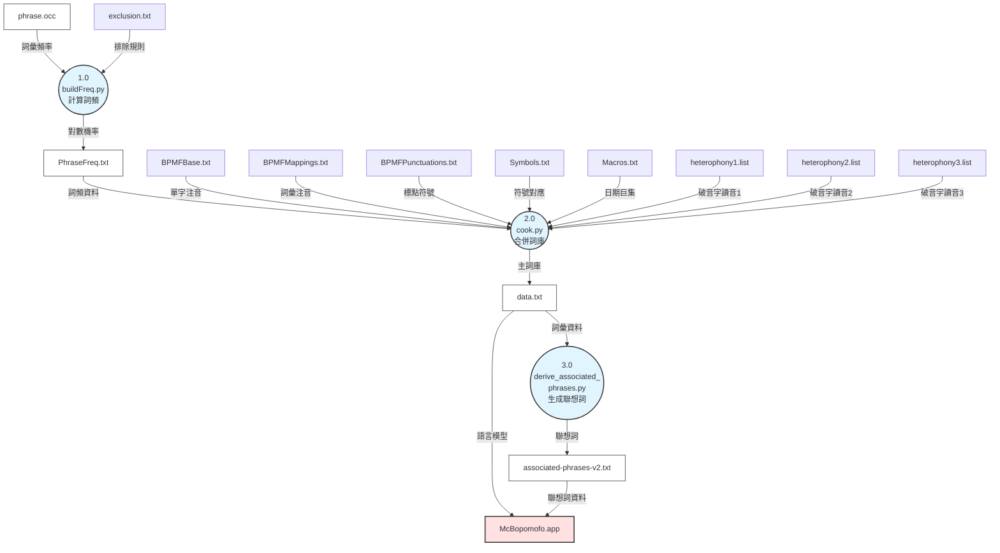

# 小麥注音輸入法演算法說明

本文件詳細說明小麥注音輸入法的核心演算法，包括注音符號到中文字詞的預測轉換機制、語言模型架構、以及字典資料的生成與使用方式。

## 建置與測試

詳細的建置與測試說明請參閱根目錄的 `AGENTS.md` 文件。
- **開發環境需求：** macOS 14.7+, Xcode 15.3+, Python 3.9+
- **執行環境需求：** macOS 10.15 (Catalina) 或以上版本

---

## 目錄

- [小麥注音輸入法演算法說明](#小麥注音輸入法演算法說明)
  - [建置與測試](#建置與測試)
  - [目錄](#目錄)
  - [整體架構](#整體架構)
    - [基本運作流程](#基本運作流程)
  - [注音轉換演算法：Gramambular](#注音轉換演算法gramambular)
    - [基本概念](#基本概念)
    - [資料結構](#資料結構)
      - [1. Unigram (語元)](#1-unigram-語元)
      - [2. Node (節點)](#2-node-節點)
      - [3. Span (跨度)](#3-span-跨度)
      - [4. ReadingGrid (讀音網格)](#4-readinggrid-讀音網格)
    - [演算法流程](#演算法流程)
      - [插入注音時的處理](#插入注音時的處理)
      - [節點更新機制](#節點更新機制)
      - [最佳路徑演算法：Viterbi](#最佳路徑演算法viterbi)
    - [實際範例](#實際範例)
    - [Viterbi 動態規劃表格展開](#viterbi-動態規劃表格展開)
    - [時間與空間複雜度](#時間與空間複雜度)
    - [與教科書 Viterbi 演算法的關係](#與教科書-viterbi-演算法的關係)
    - [使用者選字覆寫](#使用者選字覆寫)
  - [語言模型架構](#語言模型架構)
    - [McBopomofoLM：統一介面](#mcbopomofolm統一介面)
    - [Unigram 處理流水線](#unigram-處理流水線)
      - [階段 1：收集原始 Unigrams](#階段-1收集原始-unigrams)
      - [階段 2：過濾與轉換](#階段-2過濾與轉換)
      - [階段 3：使用者詞彙分數調整](#階段-3使用者詞彙分數調整)
    - [ParselessLM 與二元搜尋](#parselesslm-與二元搜尋)
      - [ParselessPhraseDB 資料格式](#parselessphrasedb-資料格式)
      - [二元搜尋實作](#二元搜尋實作)
  - [情境式使用者模型](#情境式使用者模型)
    - [動機：UserOverrideModel 的限制](#動機useroverridemodel-的限制)
    - [平滑演算法選型](#平滑演算法選型)
    - [關鍵洞見：「丼」問題](#關鍵洞見丼問題)
    - [兩層插值模型](#兩層插值模型)
    - [時間衰減](#時間衰減)
    - [持久化與容量管理](#持久化與容量管理)
  - [字典資料的生成與使用](#字典資料的生成與使用)
    - [資料檔案結構](#資料檔案結構)
      - [輸入檔案（手動維護）](#輸入檔案手動維護)
      - [輸出檔案（自動生成）](#輸出檔案自動生成)
    - [編譯流程](#編譯流程)
    - [頻率計算](#頻率計算)
      - [步驟 1：載入資料](#步驟-1載入資料)
      - [步驟 2：排除計數調整](#步驟-2排除計數調整)
      - [步驟 3：正規化與對數轉換](#步驟-3正規化與對數轉換)
    - [破音字處理](#破音字處理)
    - [資料排序的重要性](#資料排序的重要性)
  - [關鍵程式碼位置](#關鍵程式碼位置)
    - [演算法核心](#演算法核心)
    - [演算法擴展](#演算法擴展)
    - [語言模型](#語言模型)
    - [字典資料處理](#字典資料處理)
    - [Swift \& Objective-C++ 層](#swift--objective-c-層)
    - [測試](#測試)
  - [延伸閱讀](#延伸閱讀)

---

## 整體架構

小麥注音輸入法採用三層式架構設計：

1. **Swift 層**（UI & State Management）
   - IMK 整合與使用者介面元件
   - 狀態機實作
   - 偏好設定管理

2. **Objective-C++ 橋接層**
   - 連接 Swift 事件與 C++ 引擎
   - 封裝 C++ 語言模型供 Swift 使用

3. **C++ 引擎層**
   - 核心語言處理與資料結構
   - Bopomofo 音節處理
   - 文字分段演算法

### 基本運作流程

1. **鍵盤事件處理**：使用者按下按鍵 → `InputMethodController` 接收事件
2. **注音驗證**：透過 `Mandarin` 模組驗證是否為合法注音符號
3. **語言模型查詢**：向 `McBopomofoLM` 查詢符合注音的字詞
4. **建立候選網格**：將字詞插入 `ReadingGrid`
5. **路徑計算**：`ReadingGrid` 執行 walk 演算法找出最佳組合
6. **結果輸出**：將結果回傳至使用者正在輸入的應用程式

---

## 注音轉換演算法：Gramambular

Gramambular 是小麥注音的核心選字引擎，負責從多組注音符號對應的候選字詞中，找出機率最高的組合結果。

### 基本概念

小麥注音目前僅使用 **Unigram 語言模型**，這意味著：
- 每個字詞都有獨立的出現機率（不考慮上下文）
- 透過最大似然估計（Maximum Likelihood Estimation）找出最佳路徑
- 使用 **對數機率**（log probability）避免數值下溢問題

### 資料結構

Gramambular 使用三種核心資料結構，定義於 `Source/Engine/gramambular2/reading_grid.h`：

#### 1. Unigram (語元)

```text
Record UNIGRAM
    value    : string    // 字詞本身，如「在」
    rawValue : string    // 原始值（用於轉換前追蹤）
    score    : double    // 對數機率分數，如 -2.23651546
```

#### 2. Node (節點)

```text
Record NODE
    reading        : string        // 讀音，如「ㄗㄞˋ」
    spanningLength : integer       // 跨越長度（佔幾個注音）
    unigrams       : UNIGRAM[]     // 候選字詞列表
    overrideType   : OverrideType  // 使用者選字覆寫狀態
```

一個 Node 代表：
- 特定讀音下的所有候選字詞
- 該字詞在網格中佔據的長度
- 使用者是否手動選字（override）

#### 3. Span (跨度)

```text
Record SPAN
    nodes     : NODE[1..MAX-SPAN-LENGTH]  // 依長度索引，最多 8 個不同長度的節點
    maxLength : integer                   // 當前最大長度
```

一個 Span 是相同起點位置的節點集合，依長度分類（1字詞、2字詞...最多8字詞）。

#### 4. ReadingGrid (讀音網格)

```text
Record READING-GRID
    readings : string[]   // 使用者輸入的注音序列
    spans    : SPAN[]     // 每個位置的 Span
    cursor   : integer    // 游標位置
    lm       : LM         // 語言模型介面
```

ReadingGrid 是所有 Span 的集合，大小等於輸入的注音數量。

### 演算法流程

#### 插入注音時的處理

當使用者輸入一個新的注音符號時（`Source/Engine/gramambular2/reading_grid.cpp:52`）：

```text
Procedure INSERT-READING(grid : READING-GRID, reading : string)
    Input:  grid — 讀音網格；reading — 新的注音字串
    Output: true 若插入成功，false 若讀音無對應字詞

    // 1. 驗證注音是否有對應字詞
    if not grid.lm.hasUnigrams(reading):
        return false

    // 2. 插入讀音到序列中
    insert reading into grid.readings at grid.cursor

    // 3. 擴展網格（新增一個 Span 位置）
    EXPAND-GRID-AT(grid, grid.cursor)

    // 4. 更新受影響範圍的節點
    UPDATE(grid)

    // 5. 移動游標
    grid.cursor = grid.cursor + 1
    return true
```

#### 節點更新機制

`update()` 方法（`Source/Engine/gramambular2/reading_grid.cpp:336`）會在游標附近的範圍內（前後 8 個位置），嘗試建立所有可能的多字詞節點：

```text
Procedure UPDATE(grid : READING-GRID)
    Input:  grid — 讀音網格（游標附近的範圍將被重新計算）
    Output: 無（就地更新 grid.spans）

    begin = max(0, grid.cursor - MAX-SPAN-LENGTH)
    end   = grid.cursor + MAX-SPAN-LENGTH

    for pos = begin to end - 1:
        for len = 1 to MAX-SPAN-LENGTH while pos + len <= end:
            // 組合連續的注音（用 "-" 分隔）
            combinedReading = COMBINE-READING(grid.readings, pos, pos + len)

            // 向語言模型查詢是否有對應字詞
            unigrams = grid.lm.getUnigrams(combinedReading)
            if unigrams is not empty:
                // 建立新節點並插入對應的 Span
                node = new NODE(combinedReading, len, unigrams)
                grid.spans[pos].nodes[len] = node
```

#### 最佳路徑演算法：Viterbi

`walk()` 方法使用 **Viterbi 演算法** 找出分數最高的路徑（`Source/Engine/gramambular2/reading_grid.cpp:133`）。

Reading Grid 本身是一個線性格架（lattice）：每個位置只能連接到更後方的位置，構成天然的拓撲順序。因此不需要額外的拓撲排序，直接按位置順序前向掃描即可。

演算法使用一個動態規劃（DP）表格，每個 entry 記錄到達該位置的最大累計分數和回溯指標：

```text
Record STATE
    fromIndex : integer = 0          // 回溯來源位置
    fromNode  : NODE    = nil        // 回溯來源節點
    maxScore  : double  = -infinity  // 到達此位置的最大累計分數
```

**步驟 1：前向傳遞（Forward Pass）**

從位置 0 開始，依序掃描每個位置。對於每個位置上所有可能的候選詞節點，計算「到達該詞末端位置」的累計分數，並執行鬆弛（relaxation）：

```text
Procedure VITERBI-FORWARD(grid : READING-GRID)
    Input:  grid — 讀音網格
    Output: viterbi — STATE 陣列（大小 readingLen + 1）

    readingLen = length(grid.readings)
    viterbi = array of STATE, size = readingLen + 1
    viterbi[0].maxScore = 0.0

    for i = 0 to readingLen - 1:
        span       = grid.spans[i]
        maxSpanLen = span.maxLength

        for spanLen = 1 to maxSpanLen:
            node = span.nodes[spanLen]
            if node is nil:
                continue

            // 鬆弛操作：若經由目前節點到達目標位置的分數更高，則更新
            score  = viterbi[i].maxScore + node.score
            target = viterbi[i + spanLen]
            if score > target.maxScore:
                target.maxScore  = score
                target.fromNode  = node
                target.fromIndex = i

    return viterbi
```

**核心洞察**：此鬆弛操作與 HMM Viterbi 解碼的遞迴式相同（Jurafsky & Martin, SLP3 附錄 A）：

$$v_t(j) = \max_i \left[ v_{t-1}(i) \times a_{ij} \times b_j(o_t) \right]$$

但因為我們的 unigram 模型沒有轉移機率（$a_{ij} = 1$），且發射分數是對數機率（乘法變為加法），遞迴式簡化為：

$$\text{viterbi}[i + L] = \max\left(\text{viterbi}[i + L],\; \text{viterbi}[i] + \text{score}(node)\right)$$

因為使用對數機率，分數越大代表機率越高，所以鬆弛操作使用 `>` 而非 `<`。

**步驟 2：回溯路徑（Backward Pass）**

從 DP 表格的末端回溯，透過 `fromIndex` 和 `fromNode` 指標重建最佳路徑：

```text
Procedure VITERBI-BACKWARD(viterbi : STATE[], readingLen : integer)
    Input:  viterbi — 前向傳遞產生的 STATE 陣列；readingLen — 讀音數量
    Output: nodes — 最佳路徑的節點序列（由左至右）

    nodes = empty list
    curr = readingLen
    while curr > 0:
        assert viterbi[curr].fromNode is not nil
        append viterbi[curr].fromNode to nodes
        curr = viterbi[curr].fromIndex
    reverse nodes
    // 實作中另以 assert 驗證回溯路徑的總跨度等於 readingLen
    return nodes
```

### 實際範例

假設使用者輸入「ㄗㄞˋ ㄨㄛˇ ㄆㄧㄥˊ ㄈㄢˊ」（在我平凡），網格結構如下：

| 位置 | 0 | 1 | 2 | 3 |
|------|---|---|---|---|
| **注音** | ㄗㄞˋ | ㄨㄛˇ | ㄆㄧㄥˊ | ㄈㄢˊ |
| **4字Span** | | | | |
| **3字Span** | | | | |
| **2字Span** | | | 平凡(-5.14) | |
| **1字Span** | 在(-2.24) | 我(-2.27) | 平(-3.27) | 繁(-4.14) |
| | 再(-4.12) | | 萍(-6.89) | 凡(-5.33) |

可能的路徑與分數：

1. **在 → 我 → 平凡**：-2.24 + -2.27 + -5.14 = **-9.65** (最高分)
2. **在 → 我 → 平 → 繁**：-2.24 + -2.27 + -3.27 + -4.14 = -11.92
3. **再 → 我 → 平凡**：-4.12 + -2.27 + -5.14 = -11.53

演算法選擇分數最高的路徑「在我平凡」作為輸出結果。

### Viterbi 動態規劃表格展開

以下使用上述「在我平凡」的相同資料，展示 `viterbi[]` 表格如何逐步填充。此展開方式參考 SLP3 附錄 A 的 trellis 圖解（Figure A.8）以及 FSNLP 第 9 章的 delta 表格：

```
viterbi[] 表格（初始化為 -inf，viterbi[0] = 0）：

位置 0（ㄗㄞˋ）：
  spanLen=1: 在(-2.24) → viterbi[1] = max(-inf, 0 + -2.24) = -2.24, from=0, node=在
  spanLen=1: 再(-4.12) → viterbi[1] = max(-2.24, 0 + -4.12) = -2.24（未更新）

位置 1（ㄨㄛˇ）：
  spanLen=1: 我(-2.27) → viterbi[2] = max(-inf, -2.24 + -2.27) = -4.51, from=1, node=我

位置 2（ㄆㄧㄥˊ）：
  spanLen=1: 平(-3.27) → viterbi[3] = max(-inf, -4.51 + -3.27) = -7.78, from=2, node=平
  spanLen=2: 平凡(-5.14) → viterbi[4] = max(-inf, -4.51 + -5.14) = -9.65, from=2, node=平凡

位置 3（ㄈㄢˊ）：
  spanLen=1: 繁(-4.14) → viterbi[4] = max(-9.65, -7.78 + -4.14) = -9.65（未更新，-11.92 < -9.65）

回溯 viterbi[4]：平凡(from=2) → 我(from=1) → 在(from=0)
結果：在 → 我 → 平凡（分數：-9.65）
```

此表格展開與上方的路徑枚舉結果完全一致，但計算方式不同：路徑枚舉需要考察所有可能路徑（指數級），而 Viterbi DP 對每個位置、每個候選節點只做一次鬆弛操作，在 O(|V| + |E|) 時間內完成。

### 時間與空間複雜度

**時間複雜度**：O(|V| + |E|)

- 讀音網格是一個 DAG：V = 位置（`viterbi[]` 表格的 n + 1 個 entry，n = `readings_.size()`），E = 候選詞轉移（每個非空節點對應一條邊）
- 前向傳遞按位置順序（即拓撲順序）掃描，每條邊只做一次鬆弛操作；回溯為 O(n)。這正是 `reading_grid.cpp:125` 註解所述：「The algorithm runs in O(|V| + |E|) time for G = (V, E) where G is a DAG」
- 每個位置最多有 m 個節點（m = `kMaximumSpanLength` = 8），所以 |E| <= n x m，整體隨輸入長度**線性**增長
- 比較：枚舉所有路徑的時間複雜度為指數級。Viterbi 透過**最優子結構**性質達到線性時間（SLP3 附錄 A；FSNLP 第 9.3.2 節）
- `WalkResult` 會回報實際的 `vertices` 與 `edges` 計數。實測 8001 個注音的壓力測試（`reading_grid_test.cpp:536`）：vertices = 8001、edges = 16001，walk 約 0.2ms 完成（Release 編譯）

**空間複雜度**：O(n)

- `viterbi[]` 陣列有 n+1 個元素，每個元素儲存一個 `State`（分數 + 回溯指標）
- 比較：SLP3 的一般 HMM Viterbi 需要 O(N x T) 空間，其中 N = 隱藏狀態數，T = 序列長度。我們的格狀結構中每個位置的候選數量不固定，但 DP 表格是一維的 -- 因為我們只追蹤每個位置的最佳分數，而非每個狀態的分數

### 與教科書 Viterbi 演算法的關係

McBopomofo 的格狀 walk 與標準 HMM Viterbi 演算法的對應關係：

| 概念 | 標準 HMM（SLP3/FSNLP） | McBopomofo 讀音網格 |
|------|-------------------------|---------------------|
| 隱藏狀態 | 固定狀態集合（如詞性標籤） | 每個位置的候選字詞（數量可變） |
| 觀測序列 | Token 序列 | 讀音（注音符號）序列 |
| 轉移機率 | $a_{ij}$（狀態間轉移） | 隱含 = 1（無 bigram 模型） |
| 發射機率 | $b_j(o_t)$ | `node->score()`（unigram 對數機率） |
| DP 遞迴式 | $v_t(j) = \max_i [v_{t-1}(i) \cdot a_{ij} \cdot b_j(o_t)]$ | `viterbi[i+L] = max(viterbi[i] + score)` |
| DP 表格形狀 | N x T（狀態數 x 時間步） | 一維：n+1 個位置 |

因為沒有轉移機率，格狀 Viterbi 退化為 DAG 最長路徑問題。這也是為什麼 CLRS 的 DAG 最短路徑分析同樣適用。NLP 框架（MLE 解碼）解釋了**為什麼**此演算法正確；圖論框架解釋了**多快**能完成計算。

### 使用者選字覆寫

Viterbi walk 本身只比較節點分數，不知道「使用者選字」這件事。使用者偏好完全透過**節點覆寫（override）**進入計算：呼叫端先標記節點，再重新執行 walk，walk 演算法本身不變。

**覆寫機制**（`Source/Engine/gramambular2/reading_grid.cpp:234` 的 `overrideCandidate()`）：

1. 取得游標位置所有重疊節點（`overlappingNodesAt()`），找到包含目標候選字的節點，呼叫 `selectOverrideUnigram()` 標記之。
2. 重設（reset）與被覆寫節點共享跨度位置的其他已覆寫節點，避免舊的覆寫殘留（`reading_grid.cpp:386` 的迴圈與註解）。
3. 呼叫端重新執行 `walk()`，被覆寫節點因覆寫分數而勝出。

**覆寫分數**（`reading_grid.cpp:446` 的 `Node::score()`）：

| OverrideType | 分數 |
|--------------|------|
| `kOverrideValueWithHighScore` | `kOverridingScore` = 42（`reading_grid.h:146`），保證勝過所有對數機率 |
| `kOverrideValueWithScoreFromTopUnigram` | 該節點最高分 unigram 的分數（軟覆寫，仍可能被長詞勝過） |
| `kNone` | 目前選中 unigram 的原始分數 |

**與使用者模型的關係**：學習使用者偏好的模型（現行的 `UserOverrideModel`，以及其後繼者 `ContextualUserModel`，見[情境式使用者模型](#情境式使用者模型)）運作於 walk **之外**——KeyHandler 在每次 walk 後呼叫模型的 `suggest()`，若有建議則透過 `overrideCandidate()` 套用後再 walk 一次；使用者手動選字時則呼叫 `observe()` 記錄。Walk 演算法與網格結構完全不需要知道使用者模型的存在。

---

## 語言模型架構

### McBopomofoLM：統一介面

`McBopomofoLM` (`Source/Engine/McBopomofoLM.h`) 是語言模型的 Facade 類別，整合多個資料來源：

```text
Record MCBOPOMOFO-LM
    languageModel            : ParselessLM          // 主要詞庫
    userPhrases              : UserPhrasesLM         // 使用者自訂詞彙
    excludedPhrases          : UserPhrasesLM         // 使用者排除詞彙
    phraseReplacement        : PhraseReplacementMap  // 詞彙替換表
    associatedPhrasesV2      : AssociatedPhrasesV2   // 聯想詞
    phraseReplacementEnabled : boolean               // 是否啟用詞彙替換
    externalConverterEnabled : boolean               // 是否啟用外部轉換（如簡繁轉換）
    externalConverter        : function(string) -> string
    macroConverter           : function(string) -> string
```

### Unigram 處理流水線

當 `ReadingGrid` 向 `McBopomofoLM` 查詢某個讀音的 unigrams 時，會經過以下處理流程（`McBopomofoLM.cpp:139`）：

#### 階段 1：收集原始 Unigrams

```text
Procedure GET-UNIGRAMS(lm : MCBOPOMOFO-LM, key : string)
    Input:  lm — 語言模型；key — 讀音查詢鍵
    Output: allUnigrams — 經過濾的 UNIGRAM 列表

    allUnigrams    = empty list
    userUnigrams   = empty list
    excludedValues = empty set
    insertedValues = empty set

    // 1. 載入排除清單
    if lm.excludedPhrases.hasUnigrams(key):
        for each u in lm.excludedPhrases.getUnigrams(key):
            add u.value to excludedValues

    // 2. 處理使用者自訂詞彙
    if lm.userPhrases.hasUnigrams(key):
        rawUserUnigrams = lm.userPhrases.getUnigrams(key)
        userUnigrams = FILTER-AND-TRANSFORM(rawUserUnigrams,
                                            excludedValues, insertedValues)

    // 3. 處理主詞庫
    if lm.languageModel.hasUnigrams(key):
        rawGlobalUnigrams = lm.languageModel.getUnigrams(key)
        allUnigrams = FILTER-AND-TRANSFORM(rawGlobalUnigrams,
                                           excludedValues, insertedValues)
```

#### 階段 2：過濾與轉換

`filterAndTransformUnigrams` 執行以下步驟（`McBopomofoLM.cpp:287`）：

```text
Procedure FILTER-AND-TRANSFORM(unigrams : UNIGRAM[],
                               excludedValues : set,
                               insertedValues : set)
    Input:  unigrams — 原始 UNIGRAM 列表；
            excludedValues — 需排除的字詞集合；
            insertedValues — 已插入的字詞集合（用於去除重複）
    Output: results — 經過濾與轉換的 UNIGRAM 列表

    results = empty list

    for each unigram in unigrams:
        rawValue = unigram.value

        // 步驟 1：過濾排除詞彙
        if rawValue in excludedValues:
            continue

        value = rawValue

        // 步驟 2：詞彙替換（如果啟用）
        if phraseReplacementEnabled:
            replacement = phraseReplacement.valueForKey(value)
            if replacement is not empty:
                value = replacement

        // 步驟 3：巨集轉換（如日期巨集）
        if macroConverter is not nil:
            replacement = macroConverter(value)
            if value != replacement:
                value = replacement

        // 步驟 4：外部轉換（如簡繁轉換）
        if externalConverterEnabled and externalConverter is not nil:
            replacement = externalConverter(value)
            if value != replacement:
                value = replacement

        // 步驟 5：去除重複
        if value not in insertedValues:
            append UNIGRAM(value, unigram.score, rawValue) to results
            add value to insertedValues

    return results
```

完整流水線：

```
原始 Unigrams
    ↓
步驟 1: 排除過濾
    ↓
步驟 2: 詞彙替換
    ↓
步驟 3: 巨集轉換
    ↓
步驟 4: 外部轉換
    ↓
步驟 5: 去除重複
    ↓
最終 Unigrams
```

#### 階段 3：使用者詞彙分數調整

對於單音節使用者詞彙，需要特別處理以避免過度優先（`McBopomofoLM.cpp:176`）：

```text
Procedure ADJUST-USER-PHRASE-SCORES(key : string,
                                    allUnigrams : UNIGRAM[],
                                    userUnigrams : UNIGRAM[])
    Input:  key — 讀音查詢鍵；
            allUnigrams — 主詞庫的 UNIGRAM 列表；
            userUnigrams — 使用者自訂的 UNIGRAM 列表
    Output: allUnigrams（就地更新，使用者詞彙插入至最前方）

    isMultiSyllable = key contains SEPARATOR

    if isMultiSyllable or allUnigrams is empty:
        // 多音節或無詞庫詞彙：直接使用使用者詞彙（分數為 0）
        prepend userUnigrams to allUnigrams
    else if userUnigrams is not empty:
        // 單音節：調整分數為最高分 + epsilon
        topScore = -infinity
        for each unigram in allUnigrams:
            if unigram.score > topScore:
                topScore = unigram.score

        epsilon = 0.000000001
        boostedScore = topScore + epsilon

        rewritten = empty list
        for each unigram in userUnigrams:
            append UNIGRAM(unigram.value, boostedScore) to rewritten
        prepend rewritten to allUnigrams
```

**原理**：
- 使用者詞彙預設分數為 0（最高）
- 對於單音節詞（如「丼」對應「ㄉㄨㄥˋ」），如果分數為 0，會導致多音節詞（如「動作」= 「ㄉㄨㄥˋ-ㄗㄨㄛˋ」）永遠無法勝出
- 解決方法：將單音節使用者詞彙分數設為「主詞庫最高分 + epsilon」，既保證優先，又不會完全壓制多音節詞

### ParselessLM 與二元搜尋

`ParselessLM` (`Source/Engine/ParselessLM.h`) 負責載入和查詢主詞庫，使用 `ParselessPhraseDB` 進行高效的二元搜尋。

#### ParselessPhraseDB 資料格式

詞庫檔案 `data.txt` 的格式（`Source/Engine/ParselessPhraseDB.h:35`）：

```
# format org.openvanilla.mcbopomofo.sorted
ㄅ 不 -1.234567
ㄅ 逋 -8.901234
ㄅㄚ 八 -2.345678
ㄅㄚ 巴 -3.456789
```

關鍵特性：
- **按讀音字節排序**（C locale byte order）
- **前綴匹配**：查詢「ㄅㄚ 」（含空格）可精確匹配
- **記憶體映射**：使用 `MemoryMappedFile` 避免全部載入記憶體

#### 二元搜尋實作

`ParselessPhraseDB` 使用標準二元搜尋找到符合讀音的資料行（`ParselessPhraseDB.cpp`）：

```text
Procedure FIND-ROWS(db : ParselessPhraseDB, key : string)
    Input:  db — 詞庫資料庫（已排序的記憶體映射檔案）；
            key — 讀音前綴（含尾隨空格）
    Output: results — 符合前綴的資料行列表

    line = FIND-FIRST-MATCHING-LINE(db, key)  // 二元搜尋
    if line is nil:
        return empty list

    results = empty list
    // 從找到的位置開始，收集所有前綴匹配的行
    while line < db.end:
        if line does not start with key:
            break
        lineEnd = find next newline from line
        append line[0..lineEnd] to results
        line = lineEnd + 1

    return results
```

時間複雜度：
- **查詢**：O(log n + k)，其中 n 是總行數，k 是符合的行數
- **空間**：O(1)，使用 memory-mapped file，不需載入全部資料

---

## 情境式使用者模型

`ContextualUserModel`（PR #780，`Source/Engine/ContextualUserModel.h`，位於 `McBopomofo` 命名空間，不屬於 gramambular2）是 `UserOverrideModel` 的直接後繼者（drop-in successor）：`observe()` 與 `suggest()` 的介面、三種觀察情境（同長度覆寫、組詞時的 `forceHighScoreOverride`、依覆寫後 walk 的拆詞語意）、以及「標點／句首 → `"()"` 起始脈絡」的處理都與 `UserOverrideModel` 相同，KeyHandler 的呼叫點可以直接替換（PR #781）。

### 動機：UserOverrideModel 的限制

現行的 `UserOverrideModel` 以（脈絡, 讀音）精確比對的記憶體內 LRU 快取記錄使用者選字，有兩個結構性限制：

1. **不持久化**：學習到的偏好只存在記憶體中，輸入法重啟後全部遺失。

2. **無泛化能力**：精確比對意味著一個在許多不同脈絡中被反覆確認的候選字，在「沒看過的新脈絡」中完全得不到任何加分。例如使用者在十種不同前文後都選了「丼」，下次在第十一種前文輸入 ㄉㄨㄥˋ 時，模型依然毫無建議。

`ContextualUserModel` 針對這兩點改進：以 Kneser-Ney 延續機率提供跨脈絡泛化，並將模型序列化到磁碟（`contextual-user-model.txt`），讓偏好跨重啟保存。覆寫機制本身（`overrideCandidate()` 與覆寫分數，見[使用者選字覆寫](#使用者選字覆寫)）維持不變。

### 平滑演算法選型

針對「稀疏使用者觀察疊加在強基礎語言模型（約 16 萬條目）上」的場景，評估了多種平滑技術：

| 技術 | 優點 | 缺點 | 結論 |
|------|------|------|------|
| Absolute Discounting | 簡單、充分研究 | 文獻常用的 d=0.75 對稀疏資料過於激進（多數計數僅 1-2） | **採用**，但 d 降為 0.5 |
| Standard Kneser-Ney | 大語料庫的金標準（Chen & Goodman 1999） | 使用者資料過於稀疏，全域延續機率退化 | **採用其延續機率概念**，但按讀音正規化 |
| Modified Kneser-Ney | 大資料上最高準確率 | 需從 n1-n4 統計量估計 d1、d2、d3+；零計數導致不穩定 | 不採用 |
| Bayesian/Dirichlet | 先驗權重 mu 直覺清晰 | 無多脈絡泛化；需要持有基礎模型 | 不採用 |
| Witten-Bell | 無需調參（自動） | 無法控制先驗信任度；不自然地使用基礎模型作為退回 | 不採用 |
| Jelinek-Mercer | 最簡單（一行公式） | 固定 lambda 忽略觀察計數；動態 lambda 即退化為 Dirichlet | 過於簡單 |
| Stupid Backoff | 實作簡單 | 非機率分佈；無效的對數機率；設計用於 Google 規模資料 | 不合格 |

最終設計為**絕對折扣插值 Kneser-Ney**（absolute-discounting interpolated Kneser-Ney），並針對稀疏使用者資料做了三項調整：折扣 d = 0.5、延續機率按讀音正規化、以及證據門檻（詳見下節）。模型**完全不持有基礎語言模型的參考**——證據不足時回傳空建議，呼叫端不動網格，walk 自然落回基礎模型分數，等同於把 KN 退回的較低層級「隱含化」。

### 關鍵洞見：「丼」問題

決定性的洞見來自「丼（don，丼飯）問題」：如果一個字僅在「牛肉」之後被觀察到，它是否應該在無關的脈絡（如「天氣」）中佔主導地位？

- **精確比對（UserOverrideModel）**：「丼」在新脈絡中得不到任何建議，即使使用者已在許多脈絡中確認過。
- **無條件泛化**：「丼」不論觀察多樣性如何，在所有脈絡中過度泛化。
- **KN 延續計數**：以「候選字曾在多少個*不同*脈絡中被確認」作為泛化依據——僅在單一脈絡出現的字不泛化（在無關脈絡中正確地落回基礎語言模型），在多個脈絡中被確認的字才泛化到新脈絡。

### 兩層插值模型

模型只儲存使用者 bigram 觀察，評分分為兩層，基礎語言模型則是**隱含的退回層**：

**第 1 層（Bigram）**：當（context, reading）的總衰減證據 $c_{\text{total}} \geq d$ 時，以折扣計數與延續機率插值：

$$P_{KN}(w \mid \text{context}, \text{reading}) = \frac{\max(c(w) - d, 0)}{c_{\text{total}}} + \lambda \cdot P_{\text{cont}}(w \mid \text{reading})$$

其中 $\lambda = d \cdot \frac{|\text{types}(\text{context}, \text{reading})|}{c_{\text{total}}}$。折扣 $d = 0.5$ 只在證據足夠（$c_{\text{total}} \geq d$）時套用，避免把僅有的微弱證據折扣到零以下。

**第 2 層（Continuation）**：延續機率**按讀音正規化**——分母是該讀音之下所有候選字的不同脈絡數總和，而非全部唯一 bigram 數：

$$P_{\text{cont}}(w \mid \text{reading}) = \frac{N_{1+}(\bullet,\, \text{reading},\, w)}{\sum_{w'} N_{1+}(\bullet,\, \text{reading},\, w')}$$

其中 $N_{1+}(\bullet, \text{reading}, w)$ = 候選字 $w$ 在讀音 reading 之下被觀察過的不同左脈絡數。當精確脈絡的證據不足時，模型直接以延續機率建議，但有兩個限制：

- 候選字必須已在至少 **2 個不同脈絡**中被確認（`kMinContextsForGeneralization = 2`），才允許泛化到沒看過的脈絡。
- 延續層的建議**永不**帶 `forceHighScoreOverride`（不會以分數 42 強制覆寫，只做軟覆寫）。

**隱含的基礎模型層**：任一層算出的最佳候選機率若低於最低建議機率 `kMinSuggestionProbability = 0.25`，或完全沒有證據，`suggest()` 回傳空建議。呼叫端不對網格做任何覆寫，walk 自然以基礎語言模型分數決定結果。模型因此不需要持有基礎語言模型的指標，自身保持完全獨立。

**參數設定**（`Source/Engine/ContextualUserModel.h`、`.cpp`）：
- 折扣 $d = 0.5$（`kDiscount`，僅在 $c_{\text{total}} \geq d$ 時套用）
- 泛化門檻 = 2 個不同脈絡（`kMinContextsForGeneralization`）
- 最低建議機率 = 0.25（`kMinSuggestionProbability`）

### 時間衰減

每筆觀察計數隨**牆鐘時間（wall-clock time）**指數衰減：

$$\text{decayedCount}(t) = \text{count} \times 2^{-\frac{t - t_{\text{observed}}}{\text{halfLife}}}$$

其中 halfLife 的單位是**秒**，預設值為 5400 秒（90 分鐘，`kDefaultDecayHalfLifeSeconds`）。距上次觀察每經過 90 分鐘，觀察值剩餘原始權重的一半。

此設計平衡了近期偏好與長期基礎語言模型分數：
- 最近的選擇具有強影響力
- 舊的觀察逐漸衰減；衰減到證據門檻以下時建議消失，基礎語言模型的機率重新主導
- halfLife 越短，使用者偏好越快被遺忘；越長，偏好越持久

### 持久化與容量管理

**容量上限**：模型以 LRU 串列管理（context, reading）條目，預設上限 500 條（`kDefaultCapacity`），與 `UserOverrideModel` 的 LRU 行為一致。超出上限時淘汰最久未使用的條目。

**持久化格式**（TSV v1）：

```
# mcbopomofo-contextual-user-model v1
context<TAB>reading<TAB>candidate<TAB>count<TAB>timestamp<TAB>force(0|1)
```

- **寫入**：`saveToFile()` 先寫入暫存檔再 rename 到位（原子性，不會留下半寫的檔案）。`serialize()` 提供記憶體內快照，讓不能阻塞的輸入執行緒在主執行緒取得快照後交由其他執行緒寫出。
- **讀取**：`loadFromFile()` 驗證每行的所有欄位，拒絕 NaN/Inf/負數計數，略過格式錯誤的行並回報略過數量（`LoadStats`）；檔案無法開啟時不動現有狀態。
- **複製防護**：LRU map 持有指向 LRU list 的迭代器，因此複製建構子與賦值被刪除（delete），避免複製品的迭代器指向原件。
- **資料安全**：模型只讀寫自己的檔案 `contextual-user-model.txt`（位於使用者資料目錄），與使用者自訂詞彙檔完全分離；`UserOverrideModel` 原本就只存在記憶體中，沒有需要遷移的舊資料。

**KeyHandler 整合**（PR #781）：KeyHandler 將 `_userOverrideModel` 替換為 `_contextualUserModel`，呼叫點不變——插入讀音後以 `suggest()` 查詢，有建議則 `overrideCandidate()` 後重新 walk；使用者選字時在 `fixNodeWithReading` 以選字前的 walk 結果呼叫 `observe()`（Plain Bopomofo 模式除外）。模型在 AppDelegate 啟動時載入一次，選字後在主執行緒取得 `serialize()` 快照、由序列佇列（serial queue）非同步寫出。

---

## 字典資料的生成與使用

### 資料檔案結構

`Source/Data/` 目錄包含以下檔案：

#### 輸入檔案（手動維護）

| 檔案 | 用途 | 格式範例 |
|------|------|----------|
| `BPMFBase.txt` | 單字注音表 | `在 ㄗㄞˋ zai4 -4 big5` |
| `BPMFMappings.txt` | 詞彙注音表（2-6字） | `一望無際 ㄧ ㄨㄤˋ ㄨˊ ㄐㄧˋ` |
| `phrase.occ` | 詞彙出現次數 | `一望無際	22` |
| `BPMFPunctuations.txt` | 標點符號表 | `， _punctuation_Standard_< 0.0` |
| `Symbols.txt` | 符號表 | `🔥 ㄏㄨㄛˇ -8` |
| `Macros.txt` | 日期巨集 | `MACRO@DATE_TODAY_SHORT ㄐㄧㄣ-ㄊㄧㄢ -8` |
| `heterophony1.list` | 破音字第一讀音 | `中 ㄓㄨㄥ` |
| `heterophony2.list` | 破音字第二讀音 | `中 ㄓㄨㄥˋ` |
| `heterophony3.list` | 破音字第三讀音 | `落 ㄌㄚˋ` |
| `exclusion.txt` | 詞頻排除表 | `一下	國一下` |
| `associated-punctuation.txt` | 聯想詞標點 | （特殊格式） |

#### 輸出檔案（自動生成）

| 檔案 | 生成工具 | 用途 |
|------|----------|------|
| `PhraseFreq.txt` | `buildFreq.py` | 詞頻對數值 |
| `data.txt` | `cook.py` | 主詞庫（自動選字模式） |
| `data-plain-bpmf.txt` | `cook-plain-bpmf.py` | 簡化詞庫（手動選字模式） |
| `associated-phrases-v2.txt` | `derive_associated_phrases.py` | 聯想詞資料 |

### 編譯流程

完整的編譯流程由 `Source/Data/Makefile` 定義：

```makefile
all: data.txt data-plain-bpmf.txt associated-phrases-v2.txt

# 步驟 1: 計算詞頻
PhraseFreq.txt: bin/buildFreq.py phrase.occ exclusion.txt
	bin/buildFreq.py

# 步驟 2: 合併詞庫
data.txt: bin/cook.py BPMFBase.txt BPMFMappings.txt BPMFPunctuations.txt \
          PhraseFreq.txt phrase.occ Symbols.txt Macros.txt \
          heterophony1.list heterophony2.list heterophony3.list
	bin/cook.py \
		--heterophony1 heterophony1.list \
		--heterophony2 heterophony2.list \
		--heterophony3 heterophony3.list \
		--phrase_freq PhraseFreq.txt \
		--bpmf_mappings BPMFMappings.txt \
		--bpmf_base BPMFBase.txt \
		--punctuations BPMFPunctuations.txt \
		--symbols Symbols.txt \
		--macros Macros.txt \
		--output data.txt

# 步驟 3: 生成聯想詞
associated-phrases-v2.txt: data.txt bin/derive_associated_phrases.py
	bin/derive_associated_phrases.py $< $@ associated-punctuation.txt
```

資料流向圖（Yourdon & DeMarco DFD）：


```mermaid
flowchart TD
    phrase_occ[|borders:tb|phrase.occ]
    exclusion[|borders:tb|exclusion.txt]
    buildFreq((1.0<br/>buildFreq.py<br/>計算詞頻))
    PhraseFreq[|borders:tb|PhraseFreq.txt]

    BPMFBase[|borders:tb|BPMFBase.txt]
    BPMFMappings[|borders:tb|BPMFMappings.txt]
    BPMFPunct[|borders:tb|BPMFPunctuations.txt]
    Symbols[|borders:tb|Symbols.txt]
    Macros[|borders:tb|Macros.txt]
    hetero1[|borders:tb|heterophony1.list]
    hetero2[|borders:tb|heterophony2.list]
    hetero3[|borders:tb|heterophony3.list]

    cook((2.0<br/>cook.py<br/>合併詞庫))
    data[|borders:tb|data.txt]

    derive((3.0<br/>derive_associated_<br/>phrases.py<br/>生成聯想詞))
    assoc[|borders:tb|associated-phrases-v2.txt]

    McBopomofo[McBopomofo.app]

    phrase_occ -->|詞彙頻率| buildFreq
    exclusion -->|排除規則| buildFreq
    buildFreq -->|對數機率| PhraseFreq

    PhraseFreq -->|詞頻資料| cook
    BPMFBase -->|單字注音| cook
    BPMFMappings -->|詞彙注音| cook
    BPMFPunct -->|標點符號| cook
    Symbols -->|符號對應| cook
    Macros -->|日期巨集| cook
    hetero1 -->|破音字讀音1| cook
    hetero2 -->|破音字讀音2| cook
    hetero3 -->|破音字讀音3| cook
    cook -->|主詞庫| data

    data -->|詞彙資料| derive
    data -->|語言模型| McBopomofo
    derive -->|聯想詞| assoc
    assoc -->|聯想詞資料| McBopomofo

    style buildFreq fill:#e1f5ff,stroke:#333,stroke-width:2px
    style cook fill:#e1f5ff,stroke:#333,stroke-width:2px
    style derive fill:#e1f5ff,stroke:#333,stroke-width:2px
    style phrase_occ fill:#fff,stroke:#333,stroke-width:1px
    style PhraseFreq fill:#fff,stroke:#333,stroke-width:1px
    style data fill:#fff,stroke:#333,stroke-width:1px
    style assoc fill:#fff,stroke:#333,stroke-width:1px
    style McBopomofo fill:#ffe1e1,stroke:#333,stroke-width:2px
```

**圖例（Yourdon & DeMarco 標準符號）：**
- **圓形節點**：處理程序（Process）— buildFreq.py、cook.py、derive_associated_phrases.py
- **平行線節點**：資料存儲（Data Store）— 所有 .txt 檔案與資料檔
- **方形節點**：外部實體（External Entity）— McBopomofo.app
- **標籤箭頭**：資料流（Data Flow）

> **工具路徑更新 (2024年10月)**
>
> Python 工具已從 `bin/` 遷移至 `curation/` 套件結構。
> 所有模組使用集中式路徑配置（從 `curation` 套件匯入 `PROJECT_ROOT`）。
> 舊的 `bin/` 目錄已重新命名為 `bin_legacy/` 以保留歷史參考。
>
> - `bin/buildFreq.py` → `curation/builders/frequency_builder.py`
> - `bin/cook.py` → `curation/compilers/main_compiler.py`
> - `bin/derive_associated_phrases.py` → `curation/builders/phrase_deriver.py`

### 頻率計算

`frequency_builder.py` 將詞彙出現次數轉換為對數機率（`Source/Data/curation/builders/frequency_builder.py`）：

#### 步驟 1：載入資料

```python
norm = 0.0
fscale = 2.7
phrases = {}
exclusion = {}

# 載入 phrase.occ
while True:
    line = handle.readline()
    if not line: break
    if line[0] == '#': continue
    elements = line.rstrip().split()
    phrases[elements[0]] = int(elements[1])

# 載入 exclusion.txt
while True:
    line = handle.readline()
    if not line: break
    if line[0] == '#': continue
    elements = line.rstrip().split()
    mykey = elements[0]
    myval = elements[1]
    if myval.count(mykey) < 1: continue
    if mykey in exclusion:
        exclusion[mykey].append(myval)
    else:
        exclusion[mykey] = []
        exclusion[mykey].append(myval)
```

#### 步驟 2：排除計數調整

例如：「一下」在「國一下」中出現不應計入「一下」的次數。

```python
for k in exclusion:
    for v in exclusion[k]:
        if k in phrases and v in phrases:
            phrases[k] = phrases[k] - phrases[v]
```

#### 步驟 3：正規化與對數轉換

使用 **Max-Match Segmentation** 啟發的權重計算（`len(k) / 3` 是因為 UTF-8 中文字每字 3 bytes，`fscale = 2.7` 是長詞彙權重係數）：

```python
# 計算正規化因子
for k in phrases:
    norm += fscale ** (len(k) / 3 - 1) * phrases[k]

# 輸出對數機率（零次數視為 0.5 次）
for k in phrases:
    if phrases[k] < 1:
        handle.write('%s %.8f\n' % (k, math.log(fscale ** (len(k) / 3 - 1) * 0.5 / norm, 10)))
    else:
        handle.write('%s %.8f\n' % (k, math.log(fscale ** (len(k) / 3 - 1) * phrases[k] / norm, 10)))
```

**公式解釋**：

$$
P(\text{詞彙}) = \frac{\text{fscale}^{(\text{字數} - 1)} \times \text{出現次數}}{\sum_{\text{所有詞}} \text{fscale}^{(\text{字數} - 1)} \times \text{出現次數}}
$$

$$
\text{對數機率} = \log_{10} P(\text{詞彙})
$$

其中 `fscale = 2.7` 的作用是**提升長詞彙的權重**，因為：
- 2字詞權重：$2.7^{2-1} = 2.7$
- 3字詞權重：$2.7^{3-1} = 7.29$
- 4字詞權重：$2.7^{4-1} = 19.68$

這反映了長詞彙更具有語義完整性，應該優先選擇。

### 破音字處理

`main_compiler.py` 根據破音字清單調整單字的詞頻（`Source/Data/curation/compilers/main_compiler.py:146`，`H_DEFLT_FREQ = -6.8` 定義於第 12 行）：

```python
for mykey, myvalue in phrases.items():
    readings = bpmf_phrases.get(mykey)

    if readings:
        # 剛好一個中文字字的長度目前還是 3 (標點、聲調好像都是2)
        if len(mykey) > 3:
            for r in readings:
                output.append((mykey, r, myvalue))
                pass
            continue
        else:
            # lookup the table from canonical list
            for r in readings:
                if mykey not in bpmf_phon1:
                    output.append((mykey, r, myvalue))
                    continue
                elif str(bpmf_phon1[mykey]) == r:
                    output.append((mykey, r, myvalue))
                    continue
                elif mykey not in bpmf_phon2:
                    output.append((mykey, r, H_DEFLT_FREQ))
                    continue
                elif str(bpmf_phon2[mykey]) == r:
                    # l(3/4) = -0.28768207245178 / 頻率打七五折之意
                    # l(1/2) = -0.69314718055994 / 頻率打五折之意
                    if float(myvalue) - 0.69314718055994 > H_DEFLT_FREQ:
                        output.append((mykey, r, float(myvalue) - 0.69314718055994))
                        continue
                    else:
                        output.append((mykey, r, H_DEFLT_FREQ))
                        continue
                elif mykey not in bpmf_phon3:
                    output.append((mykey, r, H_DEFLT_FREQ))
                    continue
                elif str(bpmf_phon3[mykey]) == r:
                    # l(3/4*3/4) = -0.28768207245178*2
                    # l(1/2*1/2) = -0.69314718055994*2
                    if float(myvalue) - 0.69314718055994 * 2 > H_DEFLT_FREQ:
                        output.append(
                            (mykey, r, float(myvalue) - 0.69314718055994 * 2)
                        )
                        continue
                    else:
                        output.append((mykey, r, H_DEFLT_FREQ))
                        continue
                output.append((mykey, r, H_DEFLT_FREQ))
                # 如果是破音字, set it to default.
                # 很罕用的注音建議不要列入 heterophony?.list，這樣的話
                # 就可以直接進來這個 condition
```

**破音字處理邏輯總結**：

| 讀音分類 | 條件 | 詞頻調整 | 範例 |
|----------|------|----------|------|
| 第一讀音 | 在 `heterophony1.list` | 原始詞頻 | 中(ㄓㄨㄥ) |
| 第二讀音 | 在 `heterophony2.list` | 原始詞頻 × 0.5 | 中(ㄓㄨㄥˋ) |
| 第三讀音 | 在 `heterophony3.list` | 原始詞頻 × 0.25 | 落(ㄌㄚˋ) |
| 其他罕用 | 不在任何清單 | 固定低頻 -6.8 | 把(ㄅㄚˋ) |

對數空間的乘法操作：

$$
\text{新頻率} = \log(P) - \log(2) = \log\left(\frac{P}{2}\right)
$$

$$
\text{新頻率} = \log(P) - 2\log(2) = \log\left(\frac{P}{4}\right)
$$

### 資料排序的重要性

**關鍵要求**：`BPMFMappings.txt` 和 `phrase.occ` 必須使用 **C locale** 排序：

```bash
LC_ALL=C sort -o BPMFMappings.txt BPMFMappings.txt
LC_ALL=C sort -o phrase.occ phrase.occ
```

**原因**：
1. `ParselessPhraseDB` 使用二元搜尋，要求資料按字節順序排列
2. 不同 locale 的排序規則不同（如 UTF-8 vs Big5）
3. C locale 使用純字節值排序，最穩定且跨平台一致
4. 方便 code review 時發現重複或錯序的條目

---

## 關鍵程式碼位置

### 演算法核心

| 功能 | 檔案路徑 | 關鍵函式/類別 |
|------|----------|---------------|
| Reading Grid 主邏輯 | `Source/Engine/gramambular2/reading_grid.h:52` | `ReadingGrid` |
| 插入注音處理 | `Source/Engine/gramambular2/reading_grid.cpp:52` | `insertReading()` |
| 節點更新 | `Source/Engine/gramambular2/reading_grid.cpp:336` | `update()` |
| 最佳路徑演算法（Viterbi） | `Source/Engine/gramambular2/reading_grid.cpp:133` | `walk()` |
| 候選字覆寫 | `Source/Engine/gramambular2/reading_grid.cpp:234` | `overrideCandidate()` |
| 覆寫分數 | `Source/Engine/gramambular2/reading_grid.cpp:446`、`reading_grid.h:146` | `Node::score()`, `kOverridingScore` |

### 演算法擴展

| 功能 | 檔案路徑 | 關鍵函式/類別 |
|------|----------|---------------|
| 情境式使用者模型 | `Source/Engine/ContextualUserModel.h` (PR #780) | `ContextualUserModel` |
| KN 評分與觀察 | `Source/Engine/ContextualUserModel.cpp` (PR #780) | `suggest()`, `observe()` |
| 模型持久化 | `Source/Engine/ContextualUserModel.cpp` (PR #780) | `loadFromFile()`, `saveToFile()`, `serialize()` |
| KeyHandler 整合 | `Source/KeyHandler.mm` (PR #781) | `_contextualUserModel` |

### 語言模型

| 功能 | 檔案路徑 | 關鍵函式/類別 |
|------|----------|---------------|
| 語言模型 Facade | `Source/Engine/McBopomofoLM.h:60` | `McBopomofoLM` |
| Unigram 查詢 | `Source/Engine/McBopomofoLM.cpp:139` | `getUnigrams()` |
| 過濾與轉換流水線 | `Source/Engine/McBopomofoLM.cpp:287` | `filterAndTransformUnigrams()` |
| 使用者詞彙分數調整 | `Source/Engine/McBopomofoLM.cpp:176` | `getUnigrams()` 內部邏輯 |
| 主詞庫載入 | `Source/Engine/ParselessLM.h:37` | `ParselessLM` |
| 二元搜尋詞庫 | `Source/Engine/ParselessPhraseDB.h:43` | `ParselessPhraseDB` |

### 字典資料處理

| 功能 | 檔案路徑 | 說明 |
|------|----------|------|
| 編譯流程 | `Source/Data/Makefile` | 定義所有編譯目標與依賴 |
| 頻率計算 | `Source/Data/curation/builders/frequency_builder.py` | 將出現次數轉為對數機率 |
| 詞庫合併 | `Source/Data/curation/compilers/main_compiler.py` | 合併所有資料源生成 data.txt |
| 破音字處理 | `Source/Data/curation/compilers/main_compiler.py:146` | 根據清單調整破音字頻率 |
| 聯想詞生成 | `Source/Data/curation/builders/phrase_deriver.py` | 從詞庫生成聯想詞 |

### Swift & Objective-C++ 層

| 功能 | 檔案路徑 | 說明 |
|------|----------|------|
| 輸入法控制器 | `Source/InputMethodController.swift` | IMK 主入口，處理鍵盤事件 |
| 狀態機 | `Source/InputState.swift` | 所有輸入狀態的定義 |
| 按鍵處理橋接 | `Source/KeyHandler.mm` | Swift 與 C++ 之間的橋接 |
| 語言模型橋接 | `Source/LanguageModelManager.mm` | 封裝 McBopomofoLM 供 Swift 使用 |
| 橋接標頭檔 | `Source/McBopomofo-Bridging-Header.h` | Objective-C++ 介面宣告 |

### 測試

| 功能 | 檔案路徑 | 說明 |
|------|----------|------|
| Swift 單元測試 | `McBopomofoTests/` | 使用 Swift Testing 框架 |
| C++ 引擎測試 | `Source/Engine/CMakeLists.txt` | Google Test 測試定義 |
| 測試執行 | `Source/Engine/build/` | CMake 編譯目錄 |

---

## 延伸閱讀

**Viterbi 演算法與語言模型**：
- Jurafsky & Martin, *Speech and Language Processing*, 3rd Edition, Chapter 8 (Viterbi); Appendix A (HMM Viterbi DP)
- 格架上的 Viterbi：[vene.ro/blog/shortest-paths-in-lattices](https://vene.ro/blog/shortest-paths-in-lattices.html)

**平滑與退回**：
- Jurafsky & Martin, *SLP3*, Chapter 3 (Smoothing, Backoff vs Interpolation, Kneser-Ney); Appendix C (Kneser-Ney detail)
- Manning & Schutze, *Foundations of Statistical Natural Language Processing*, Chapter 6, Sec. 6.3-6.4 (Good-Turing, Katz backoff, linear interpolation)
- Chen, S. F. & Goodman, J. (1999). An empirical study of smoothing techniques for language modeling. *Computer Speech & Language*, 13(4), 359-394.

**專案資源**：
- [Wiki: 程式架構](https://github.com/openvanilla/McBopomofo/wiki/程式架構)
- [Wiki: Gramambular 演算法](https://github.com/openvanilla/McBopomofo/wiki/程式架構_Gramambular)
- [Wiki: 詞庫開發說明](https://github.com/openvanilla/McBopomofo/wiki/詞庫開發說明)
- [X/Twitter 演算法說明串](https://x.com/McBopomofo/status/1559356063622631424)

---

**文件版本**：1.4
**最後更新**：2026-06-11T09:00:00+09:00
**適用版本**：McBopomofo 2.x 及以上
